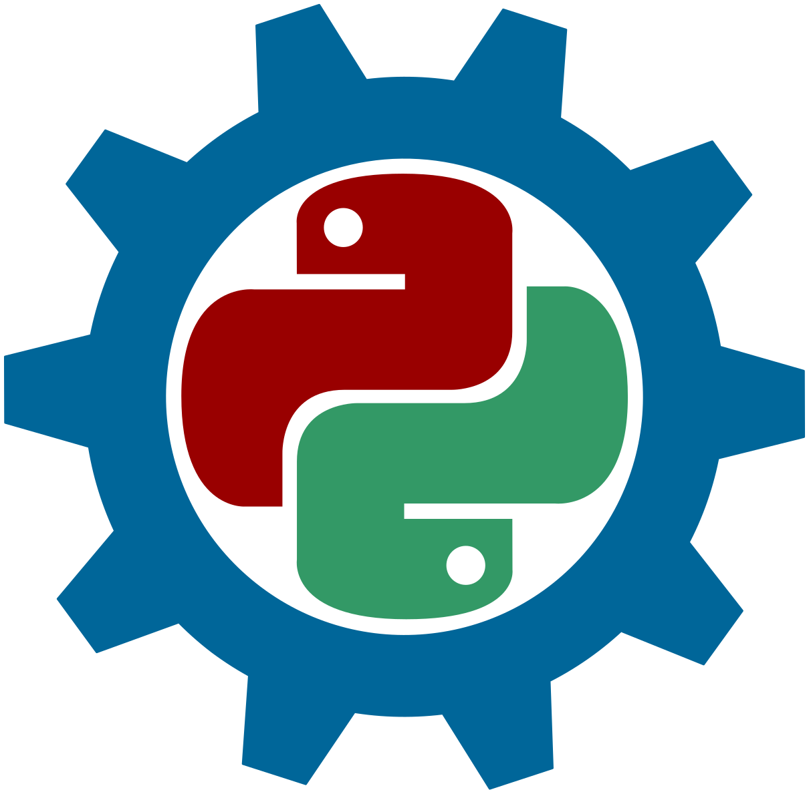

# Robots de Vikidia

Nos moyens de développement :&#x20;

<table data-view="cards"><thead><tr><th></th><th></th><th></th><th data-hidden data-card-target data-type="content-ref"></th></tr></thead><tbody><tr><td><h4><i class="fa-python">:python:</i></h4></td><td><strong>Python</strong></td><td>langage de programmation qui permet de travailler plus rapidement et d’intégrer des systèmes plus efficacement.</td><td><a href="https://template.gitbook.com/space-product-docs">https://template.gitbook.com/space-product-docs</a></td></tr><tr><td><h4><i class="fa-server">:server:</i></h4></td><td><h3 id="firstheading">Pywikibot</h3></td><td>librairie Python avec une collection d'outils permettant d'automatiser les tâches sur les sites utilisant MediaWiki.</td><td><a href="https://template.gitbook.com/space-product-docs">https://template.gitbook.com/space-product-docs</a></td></tr><tr><td><h4><i class="fa-terminal">:terminal:</i></h4></td><td><strong>AutoWikiBrowser</strong></td><td>Éditeur MediaWiki semi-automatisé destiné à rendre les tâches répétitives plus rapides et plus faciles.</td><td><a href="https://template.gitbook.com/space-api-reference">https://template.gitbook.com/space-api-reference</a></td></tr></tbody></table>



### Comment commencer ?

Télécharger Python et l'installer à partir de [https://www.python.org/downloads/](https://www.python.org/downloads/).

Si vous avez déjà Python d'installé, la commande `python --version` permet d'afficher sa version dans le terminal et de vérifier qu'il est à jour.

&#x20;<a href="https://www.mediawiki.org/wiki/Manual:Pywikibot/Installation/fr" class="button secondary" data-icon="sign-posts-wrench">Installation de Pywikibot</a>




```bash
# Vérifier la version de Python
python --version

# Installer les dépendances
$ python3 -m pip install "requests>=2.20.1"
$ python3 -m pip install "mwparserfromhell>=0.5.2"
$ python3 -m pip install packaging

# Installer Pywikibot
$ python3 -m pip install pywikibot
```





{% column width="41.66666666666667%" %}
<figure><figcaption></figcaption></figure>


{% column width="58.33333333333333%" %}
#### **En savoir plus sur les bots**

Lisez les guides et apprenez-en davantage sur l'utilisation des bots sur Vikidia.

<a href="general/les-repositories.md" class="button primary" data-icon="book-open">Guides</a> <a href="https://www.mediawiki.org/wiki/Manual:Pywikibot/fr" class="button secondary" data-icon="book">Documentation</a>



<h2 align="center">Rejoindre la communauté</h2>

<table data-card-size="large" data-view="cards"><thead><tr><th></th><th></th><th></th><th></th><th data-hidden data-card-cover data-type="files"></th></tr></thead><tbody><tr><td><h4><i class="fa-discord">:discord:</i></h4></td><td><strong>Communauté Discord</strong></td><td>Rejoint notre serveur Discord pour le développement de bots pour Vikidia !</td><td><a href="https://discord.gg/fHVu6eFwcX" class="button secondary" data-icon="discord">Join Discord</a></td><td></td></tr><tr><td><h4><i class="fa-github">:github:</i></h4></td><td><strong>GitHub</strong></td><td>Our product is 100% open source and built by developers just like you. Head to our GitHub repository to learn how to submit your first PR.</td><td><a href="https://github.com/Les-dev-de-bot-vikidiens" class="button secondary" data-icon="github">Notre Github</a></td><td></td></tr></tbody></table>
